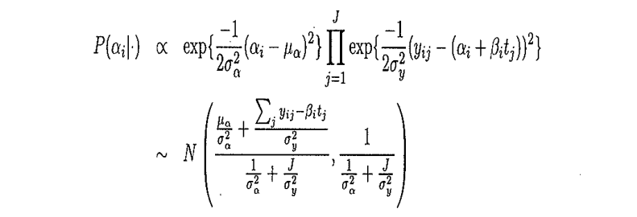
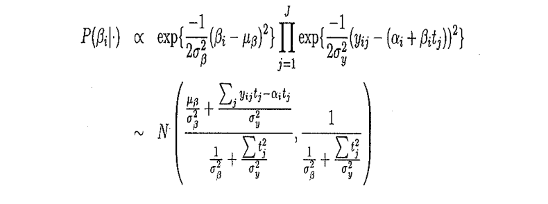
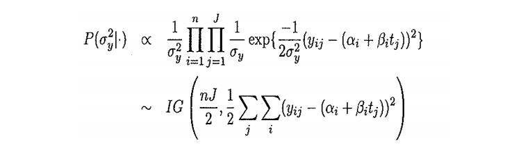
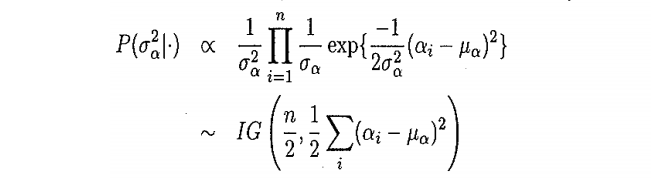
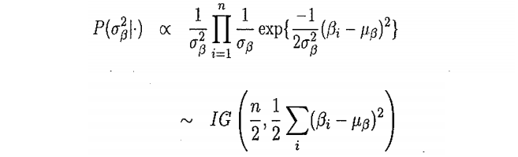
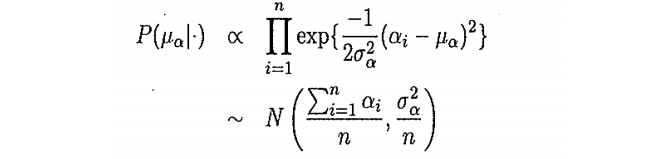

```{r setup, include=FALSE}
knitr::opts_chunk$set(echo = TRUE)
library(gdata)
library(MASS)
library(pscl)
datos <- read.xls("DATOSejemploD.xlsx",sheet = 1,header = TRUE)
datos <- as.matrix(datos)
datos <- datos[,-6]
tiempos<-c(8.0,15.0,22.0,29.0,36.0)
tiempos <- tiempos - mean(tiempos)
colnames(datos) <- paste0("tiempo",1:length(datos[1,]))
rownames(datos) <- paste0("rata",1:length(datos[,1]))
```

##Introducción
Considera un modelo de regresión con efectos aleatorios para analizar los datos del ejemplo D
(ratas.xls: contiene las observaciones del peso en 5 momentos del tiempo : 8,15,22,29 y 36 días).
Considera que tanto el término independiente como el coeficiente de la variable explicativa
(tiempo centrado $(x-\bar x)$) son a su vez variables aleatorias normales que dependen de hiperparámetros.

## Modelo en términos de los parámetros e hiperparámetros. 

Modelo jerárquico normal:
$$y_{ij}\;=\; Peso\;de\;la\;rata\;i\;en\;el\;día\;x_j\;,\;i\in\{1,2,...,30\}\;,\;x_j\in\{8,15,22,29,36\}$$
$$x_j\;=\;Momento\;de\;tiempo\;j\;,\;j\in\{1,2,3,4,5\}\;,\;x_j\in\{8,15,22,29,36\}$$
$$y_{ij} \sim Normal(\alpha_i + \beta_i·(x_j-\bar{x}) ,\;\sigma_y^2)$$  
donde:  

$$\alpha_i \sim Normal(\mu_\alpha,\sigma_\alpha^2)$$
$$\beta_i \sim Normal(\mu_\beta,\sigma_\beta^2)$$

## Resumen de los datos

```{r, echo=FALSE,warning=FALSE}
datos
```
Medias:
```{r, echo=FALSE,warning=FALSE}
apply(datos, 2, mean)
```
Varianzas:
```{r, echo=FALSE,warning=FALSE}
apply(datos, 2, var)
```

## Implementación del Modelo jerárquico en R:

### Funciones de las Distribuciones condicionadas de los parámetros
 
```{r,warning=FALSE}
alpha_condicionada <- function(mu_alpha,sigma2_alpha,peso,beta,tiempos){
  J <- length(peso)
  media <- 0
  varianza <- 0
  sumatorio <- 0
  for(j in 1:J){
      sumatorio <- sumatorio + (peso[j]-beta*tiempos[j])
  }
  media <- (mu_alpha/sigma2_alpha) + (sumatorio/((1/sigma2_alpha)+(J/sigma2_y)))
  varianza <- 1/((1/sigma2_alpha)+(J/sigma2_y))
  return(rnorm(1,media,sqrt(varianza)))
}
``` 
 
```{r,warning=FALSE}
beta_condicionada <- function(mu_beta,sigma2_beta,peso,alpha,tiempos){
  J <- length(peso)
  media <- 0
  varianza <- 0
  sumatorio <- 0
  for(j in 1:J){
    sumatorio <- sumatorio+(peso[j]*tiempos[j]-alpha*tiempos[j])
  }
  media <- ((mu_beta/sigma2_beta) + (sumatorio/sigma2_y))/((1/sigma2_beta)+(sum(tiempos^2)/sigma2_y))
  varianza <- 1/((1/sigma2_beta)+(sum(tiempos^2)/sigma2_y))
  return(rnorm(1,media,sqrt(varianza)))
}
```
 
```{r,warning=FALSE}
sigma2_y_condicionada <- function(Y,alpha,beta,X){
  n <- dim(Y)[1]
  J <- dim(Y)[2]
  media <- n*J/2
  sumatorio <- 0.0
  for(j in 1:J){
    for(i in 1:n){
      sumatorio <- sumatorio + (Y[i,j] - (alpha[i] + beta[i]*X[j]))^2
    }
  }
  dispersion <- sumatorio/2
  gamma_inversa <- rigamma(n=1,alpha = media,beta = dispersion)
  return(gamma_inversa)
}
```
 
```{r,warning=FALSE}
sigma2_alpha_condicionada <- function(Y,alpha,mu_alpha){
  n <- dim(Y)[1]
  media <- n/2
  sumatorio <- 0
  for(i in 1:n){
    sumatorio <- sumatorio + (alpha[i] - mu_alpha)^2
  }
  dispersion <- sumatorio/2
  gamma_inversa <- rigamma(n=1,alpha=media,beta =dispersion)
  return(gamma_inversa)
}
```
 
```{r,warning=FALSE}
sigma2_beta_condicionada <- function(Y,beta,mu_beta){
  n <- dim(Y)[1]
  media <- n/2
  sumatorio <- 0
  for(i in 1:n){
    sumatorio <- sumatorio + (beta[i] - mu_beta)^2
  }
  dispersion <- sumatorio/2
  gamma_inversa <- rigamma(n=1,alpha=media,beta =dispersion)
  return(gamma_inversa)
}
```
 
```{r,warning=FALSE}
mu_alpha_condicionada <- function(Y,alpha,sigma2_alpha){
  n <- dim(Y)[1]
  media <- sum(alpha)/n
  varianza <- sigma2_alpha/n
  return(rnorm(1,media,sqrt(varianza)))
}
```
 
```{r,warning=FALSE}
mu_beta_condicionada <- function(Y,beta,sigma2_beta){
  n <- dim(Y)[1]
  media <- sum(beta)/n
  varianza <- sigma2_beta/n
  return(rnorm(1,media,sqrt(varianza)))
}
```
### Implementación del algoritmo de Gibbs en R:
Buscamos el mayor nivel de actualización, por lo que actualizamos todos los parámetros en cada iteracción para cada una de las ratas.
```{r,warning=FALSE}
gibbs <- function(datos,tiempos,numero_iteraciones,alpha,beta,sigma2_y,sigma2_alpha,sigma2_beta,mu_alpha,mu_beta){
  numero_parametros<-length(alpha)+length(beta)+5
  parametros<-matrix(rep(0.00,numero_parametros*numero_iteraciones),c(numero_iteraciones,numero_parametros))
  colnames(parametros)<-c(paste0("alpha",1:30),paste0("beta",1:30),"sigma_2_y","sigma2_alpha","sigma2_betas","mu_alpha","mu_beta")
  parametros[1,] <- c(alpha,beta,sigma2_y,sigma2_alpha,sigma2_beta,mu_alpha,mu_beta)
  for(i in 1:numero_iteraciones){
    for(j in 1:length(alpha)){
      mu_alpha <- mu_alpha_condicionada(datos,alpha,sigma2_alpha)
      mu_beta <- mu_beta_condicionada(datos,beta,sigma2_beta)
      sigma2_y <- sigma2_y_condicionada(datos,alpha,beta,tiempos)
      sigma2_alpha <- sigma2_alpha_condicionada(datos,alpha,mu_alpha)
      sigma2_beta <- sigma2_beta_condicionada(datos,beta,mu_beta)
      alpha[j] <- alpha_condicionada(mu_alpha,sigma2_alpha,datos[j,],beta[j],tiempos)
      beta[j] <- beta_condicionada(mu_beta,sigma2_beta,datos[j,],alpha[j],tiempos)
    }
    parametros_nuevos <- c(alpha,beta,sigma2_y,sigma2_alpha,sigma2_beta,mu_alpha,mu_beta)
    parametros[i,] <- parametros_nuevos
  }
  return(parametros)
}
```
### Resultados:
```{r,echo=FALSE,warning=FALSE}
numero_observaciones =dim(datos)[1]; numero_variables = dim(datos)[2]
alpha <- rep(1,30)
beta <- rep(1,30)
mu_alpha <- 1; mu_beta <- 1; sigma2_alpha <- 1; sigma2_beta <- 1; sigma2_y <- 1

numero_iteraciones<-500

start.time <- Sys.time()
params<-gibbs(datos,tiempos,numero_iteraciones,alpha,beta,sigma2_y,sigma2_alpha,sigma2_beta,mu_alpha,mu_beta)
end.time <- Sys.time()
params_buenos <- params[101:500,] #Descartamos las primeras cien (10%)
params<-rbind(c(alpha,beta,sigma2_y,sigma2_alpha,sigma2_beta,mu_alpha,mu_beta),params)

alphas <- params_buenos[,1:30];betas <-params_buenos[,31:60]
sigma2_ys <- params_buenos[,61];sigma2_alphas <- params_buenos[,62]; sigma2_betas <- params_buenos[,63]; mu_alphas <- params_buenos[,64]; mu_betas <- params_buenos[,65]
```
Obtenemos los siguientes resultados para `r numero_iteraciones` iteraciones y quemando el $10\%$ de las primeras iteraciones, en un tiempo de ejecución de **`r (end.time-start.time)`** segundos. 
  
* El vector medio de $\alpha$ (El intercept) sería:  
```{r, echo=FALSE,warning=FALSE}
apply(alphas, 2, mean)
```
* El vector medio de $\beta$ , (La pendiente) sería:  
```{r, echo=FALSE,warning=FALSE}
apply(betas, 2, mean)
```
* La desviación $\sigma_y^2$ sería: 
```{r, echo=FALSE,warning=FALSE}
mean(sigma2_ys)
```

#### Gráficas de convergencia de los parámetros en las iteraciones:
* **$\mu_\alpha$**:  
```{r, echo=FALSE,warning=FALSE}
plot(1:300,params[,64][1:300],type="l")
```  

* **$\mu_\beta$**:  
```{r, echo=FALSE,warning=FALSE}
plot(1:300,params[,65][1:300],type="l")
```  

Podemos ver como rápidamente los parámetros convergen al resultado final sin necesidad de muchas iteraciones.

## Inferencias

### Inferencias sobe el parámetro del término independiente ($\alpha$):
Bandas de credibilidad del 95 % para alpha: Bandas de confianza para :  
$$\alpha_i \sim Normal(\mu_\alpha,\sigma_\alpha^2),\;\;\;i = 1..30$$
Cuantiles de $\alpha_i$ 0.025 y 0.0975.  
Podemos decir con una credibilidad del 95 % que los valores de $\alpha_i$ para cada una de las 30 ratas están entre:
```{r, echo=FALSE,warning=FALSE}
cuantiles_alpha <- quantile(alphas[,1],probs = c(0.025, 0.975))
for(i in 2:length(alphas[1,])){
  cuantiles_alpha <- rbind(cuantiles_alpha, quantile(alphas[,i],probs = c(0.025, 0.975)))
}
rownames(cuantiles_alpha)<- paste0("rata",1:length(datos[,1]))
cuantiles_alpha
```
Un gráfico que puede representar esto sería:  
Donde se representa el Intervalo como una línea recta sólida horizontal para cada una de las ratas.
```{r, echo=FALSE,warning=FALSE}
par(mar=c(4, 4, 2, 2)+0.1);y<-c(1,1);plot(cuantiles_alpha[1,],y,ylim=c(0,31),xlim=c(215,275),type = "l",xlab = "Intervalo de credibilidad del 95 para alpha",ylab = "Rata número",col=5,yaxt='n');for(i in 2:length(alphas[1,])){y<-rbind(y,c(i,i));lines(cuantiles_alpha[i,],y[i,],type = "l",col=i)};axis(2, at=y[,1], las=0)
```

### Inferencias sobe el parámetro de la pendiente ($\beta$):  
Bandas de credibilidad del 95 % para beta: Bandas de confianza para :  
$$\beta_i \sim Normal(\mu_\beta,\sigma_\beta^2),\;\;\;i = 1..30$$
Cuantiles de $\beta_i$ 0.025 y 0.0975.  
Podemos decir con una credibilidad del 95 % que los valores de $\beta_i$ para cada una de las 30 ratas están entre:
```{r, echo=FALSE,warning=FALSE}
cuantiles_beta <- quantile(betas[,1],probs = c(0.025, 0.975))
for(i in 2:length(betas[1,])){
  cuantiles_beta <- rbind(cuantiles_beta, quantile(betas[,i],probs = c(0.025, 0.975)))
}
rownames(cuantiles_beta)<- paste0("rata",1:length(datos[,1]))
cuantiles_beta
```
Un gráfico que puede representar esto sería:  
Donde se representa el Intervalo como una línea recta sólida horizontal para cada una de las ratas.
```{r, echo=FALSE,warning=FALSE}
par(mar=c(4, 4, 2, 2)+0.1);y<-c(1,1);plot(cuantiles_beta[1,],y,ylim=c(0,31),xlim=c(4.95,7.5),type = "l",xlab = "Intervalo de credibilidad del 95 para beta",ylab = "Rata número",col=5,yaxt='n');for(i in 2:length(betas[1,])){y<-rbind(y,c(i,i));lines(cuantiles_beta[i,],y[i,],type = "l",col=i)};axis(2, at=y[,1], las=0)
```